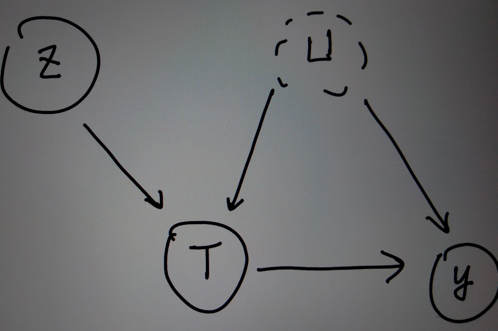

The causal inference project I am working on aims to answer if the Medicaid health insurance plan reopened in Oregon during 2008 has the positive causal effect on residents' mental and physical health. 
From this study, the method to detect heterogeneous causal effect with instrumental variable is also developed.   

## the data set  
In 2008, Oregon reopened its Medicaid-based health insurance plan for its eligible residents. It allowed a limited number of individuals to enroll in the program. 
Specifically, a household in Oregon was randomly selected by a lottery system run by the state and any eligible individual in the household can choose to enroll in the
new health insurance plan; households that weren't selected by the lottery could not enroll.  The data set has 11,808 lottery winner. The outcome variable is the number 
of days an individual's physical or mental prevented their usual activities in the past month. The individual's sex, age, whether they preferred English materials when
they sign up, whether they lived in a metropolitan area, their educational level, self-identified race were also recorded.  

## The answer this study seeks  
We often assume that the treatment effect might be the same across the individuals, ignoring the random errors. However, this study assume that some recipients of the 
treatment might benefit from the treatment more than other recipients. For example, the treatment, in this study, the enrollment of health insurance, might benefit 
sick people more than healthy people. As a result, this study aims to estimate the heterogeneous complier average causal effect.(H-CACE). When it comes the compliance ,
we can classify people into four categories: Compliers are units which their treatment values follow their instrument/ assignment of treatment values; always-takers always 
take the treatment regardless of their assignments; never-takers never take the treatment regardless of their assignments; defiers act against their assignment values. 
While compliance is taken into consideration, if we want to find a point estimate of the average treatment effect, instead of having bounds only, we would need to assume
monotonicity. Monotonicity states that the potential treatment is a monotonic function of the assignments. In other words, we would need to assume there is no defiers.  
The complier causal average effect(CACE) is defined as the expected difference between the outcomes under treatment and control. The H-CACE is defined as the CACE for
a subgroup of compliers with a specific value of pre-treament covariates.  

## The techniques involved  
To be able to show causation not only association, we often need to get rid of the confounding effects. a confounder is a variable
impacts both the treatment assignment and potential outcomes, causing a spurious association. The ideal that randomized experiments can achieve is it makes 
sure the assignment of treatment is unrelated to the potential outcomes. A tenique to mimic this ideal is via matching - we pair the recipients based on 
the similarities of the covariates, which might be confounders, and assignment treatment or control to these paired recipients and observe the difference
between their responses.  However, this technique can only deal with the confounding effects coming from obeserved covariates. For those unobserved covariates
, we cannot do matching based on those. Consequently, this study also considers the use of instrumental variable.  Instrumental variable is an approach to analysize
causal effects when unmeasured confounding is present. Consider the following causal graph.    

T is the treatment variable, Y is the outcome variable, U stands for the unobserved confounder, and Z is the instrumental variable.  Because the confounder is 
unobserved, we cannnot block the spurious association path via conditioning. Instrumental variable approach proposes that we first measure the covariance between
Z and Y, for this to detect the causal effect from Z to Y via the path Z -> T -> Y, and then divide this by the covariance between Z and T. 

