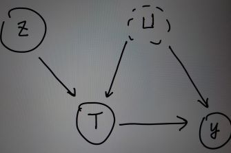

---

---

The causal inference project I am working on aims to answer if the Medicaid health insurance plan reopened in Oregon during 2008 has the positive causal effect on residents' mental and physical health. 
From this study, the method to detect heterogeneous causal effect with instrumental variable is also developed.   

## the data set  
In 2008, Oregon reopened its Medicaid-based health insurance plan for its eligible residents. It allowed a limited number of individuals to enroll in the program. 
Specifically, a household in Oregon was randomly selected by a lottery system run by the state and any eligible individual in the household can choose to enroll in the
new health insurance plan; households that weren't selected by the lottery could not enroll.  The data set has 11,808 lottery winner. The outcome variable is the number 
of days an individual's physical or mental prevented their usual activities in the past month. The individual's sex, age, whether they preferred English materials when
they sign up, whether they lived in a metropolitan area, their educational level, self-identified race were also recorded.  

## The answer this study seeks  
We often assume that the treatment effect might be the same across the individuals, ignoring the random errors. However, this study assume that some recipients of the 
treatment might benefit from the treatment more than other recipients. For example, the treatment, in this study, the enrollment of health insurance, might benefit 
sick people more than healthy people. As a result, this study aims to estimate the heterogeneous complier average causal effect.(H-CACE). When it comes the compliance ,
we can classify people into four categories: Compliers are units which their treatment values follow their instrument/ assignment of treatment values; always-takers always 
take the treatment regardless of their assignments; never-takers never take the treatment regardless of their assignments; defiers act against their assignment values. 
While compliance is taken into consideration, if we want to find a point estimate of the average treatment effect, instead of having bounds only, we would need to assume
monotonicity. Monotonicity states that the potential treatment is a monotonic function of the assignments. In other words, we would need to assume there is no defiers.  
The complier causal average effect(CACE) is defined as the expected difference between the outcomes under treatment and control. The H-CACE is defined as the CACE for
a subgroup of compliers with a specific value of pre-treament covariates.  

## The techniques involved  
To be able to show causation not only association, we often need to get rid of the confounding effects. a confounder is a variable
impacts both the treatment assignment and potential outcomes, causing a spurious association. The ideal that randomized experiments can achieve is it makes 
sure the assignment of treatment is unrelated to the potential outcomes. A tenique to mimic this ideal is via matching - we pair the recipients based on 
the similarities of the covariates, which might be confounders, and assignment treatment or control to these paired recipients and observe the difference
between their responses.  However, this technique can only deal with the confounding effects coming from obeserved covariates. For those unobserved covariates
, we cannot do matching based on those. Consequently, this study also considers the use of instrumental variable.  Instrumental variable is an approach to analysize
causal effects when unmeasured confounding is present. Consider the following causal graph.    

$T$ is the treatment variable, $Y$ is the outcome variable, $U$ stands for the unobserved confounder, and $Z$ is the instrumental variable.  Because the confounder is unobserved, we cannnot block the spurious association path via conditioning. Instrumental variable approach proposes that we first measure the covariance between
$Z$ and $Y$, for this to detect the causal effect from $Z$ to $Y$ via the path $Z \rightarrow T \rightarrow Y$, and then divide this by the covariance between $Z$ and $T$.   

## Before the Identification of Causal Effect - Assumptions  for Instrumental Variables, and why to use them?  
Recall that based on the causal graph above, we want to find the causal effect from the treatment $A$ to outcome variable $Y$. However, we suspect that there are unmeasured cofounders $U$. Because $U$ is unmeasured, we cannot condition on $U$ to identify our causal estimand.  We turn to the use of instrument $Z$.  While we escape from the unmeasured variable problem by avoiding using adjustment for confounders. We need another set of assumptions for instrumental variable $Z$.   

### Assumptions

#### i
Instrument $Z$ is associate with treatment $A$.  
#### ii
 $Z$ does not affect $Y$ except through its potential effect on treatment $A$.
#### iii
Instrument $Z$ and outcome $Y$ do not share any common causes.  
#### iv Monotonicity
Instrument $Z$ only increases the level of treatment $A$. This is an important assumption to allow us identify the causal estimand. We detail the assumption of monotonicity below.   
Imagine that $Z$ can be seen as a "encouragement" variable might urge an individual to take the treatment. $Z=0$ means the individual is not encouraged to take the treatment $A=1$, and $Z=1$ means the individual receives the encouragment to take the treatment $A=1$.  Some examples are:  
 * $Z$ is a higher pricing on cigaratte, and $A$ is the cessation of smoking.  
 * $Z$ is a shorter distance to the clinic, and $A$ is to go to see the doctor.  

We can define potential treatment taken by the indvidual as a function of the instrument. For example, $A^{Z=1} = 1$ means that this individual would take the treatment, after receiving the encouragement. $A^{Z=0} = 1$ means even if the individual does receive the encouragement to take the treatment, he would refuse the take the treatment.  Based on this notation, we can have four subpopulations based on their behavior in terms of the compliance.   
  * Always-takers:  
      Individuals who will always take teratment, regardless of the treatment group they were assigned to. That is, $A^{Z=1} = 1 = A^{Z=0}$.  
  * Never-takers:  
      Individuals who will never take treatment, regardless of the treatment group they were assigned to. That is, $A^{Z=1} = 0 = A^{Z=0}$.  
  * Compliers:  
    Individuals who would take the treatment based on what they were encouraged to. That is, $A^{Z=1} = 1$; $A^{Z=0} = 0$.  
  * Defiers:  
    Individuals who would would take the other treatment as opposed to what they were encouraged to. That is, $A^{Z=1}=0$; $A^{Z=0}=1$.   
  
  Note that these subpopulations are not identifiable. For example, if you encourage an individual to take the treatment and he did, he could be either an always-taker or a complier.  
 > When no defiers exist, we say that there is monotonicity because the instrument $Z$ either does not change the level of treatment $A$ or increases the level of treatment $A$.  
    
Generally, monotonicity holds when $A^{Z=1} \geq A^{Z=0}$ for all individuals.  

## The Identification of The causal Estimand - The Average Treatment Effect of Compliers  
We now want to show that we can identify the the average treatment effect of compliers. Define the following notatations.  
Let $Y$ be the outcome variable, $A$ be the treatment variable, $Z$ be the instrument.  Furthermore, through our derivation, we use the superscript to denote the 
potential outcome under specific intervention. Recall that $A^{Z=0}$ is the potential treatment that an individual would take if we intervene to make the instrument $Z = 0$. Similar to this notation, $Y^{A=a}$ means the potential outcome when the individual takes the treatment $A=a$; $Y^{Z=0}$ means the potential outcome when the individual receives the instrument, $Z=0$. As a sidenote, one should always remember the differences between $Y^{A=1}$, $Y|A=1$, $Y^{A=0}|A=1$, and $Y^{A=1}|A=1$. In general, the conditioning shows if the individual receives the treatment or not in real life, while the potential outcome imagines a parallel universe, consider the outcome when the same individual receives a specific treatment.

* $Y^{A=1}$ means the potential outcome of this individual when he receives treatment $A=1$.  
* $Y|A=1$ means the outcome value when an individual receives the treatment $A=1$ in real life.  
* $Y^{A=0}|A=1$ means that we wonder the potential outcome value assuming this individual receives treatment $A=0$, while he receives treatment $A=1$ in real life.  
* $Y^{A=1}|A=1$ means that we wonder the potential outcome value assuming this individual receives treatment $A=1$, while he indeed receives treatment $A=1$ in real life.  

With these notations, we want to identify the average treatment effect of compliers.

$$
\mathbb{E}(Y^{a=1} - Y^{a=0}|A^{Z=1}=1, A^{Z=0}=0)
$$
  
In particular, we want to show that, provided that we have the four assumptions, we have:  

$$
\mathbb{E}(Y^{a=1} - Y^{a=0}|A^{Z=1}=1, A^{Z=0}=0) = \frac{\mathbb{E}(Y|Z=1) - \mathbb{E}(Y|Z=0)}{\mathbb{E}(A|Z=1) - \mathbb{E}(A|Z=0)}
$$

$$
\begin{align}
\mathbb{E}(Y^{Z=1} - Y^{Z=0}) &= \mathbb{E}(Y^{Z=1} - Y^{Z=0}|A^{Z=1}=1, A^{Z=0}=1) \mathbb{P}(A^{Z=1}=1, A^{Z=0}=1) \text{    (always-takers)} \\
& + \mathbb{E}(Y^{Z=1} - Y^{Z=0}|A^{Z=1}=0, A^{Z=0}=0) \mathbb{P}(A^{Z=1}=0, A^{Z=0}=0)  \text{    (never-takers)}\\
& + \mathbb{E}(Y^{Z=1} - Y^{Z=0}|A^{Z=1}=1, A^{Z=0}=0) \mathbb{P}(A^{Z=1}=1, A^{Z=0}=0) \text{    (compliers)}\\
& + \mathbb{E}(Y^{Z=1} - Y^{Z=0}|A^{Z=1}=0, A^{Z=0}=1) \mathbb{P}(A^{Z=1}=0, A^{Z=0}=1) \text{    (defiers)}\\
& = \mathbb{E}(Y^{A=1} - Y^{A=1})\cdot \mathbb{P}(A^{Z=1}=1, A^{Z=0}=1) \\
& + \mathbb{E}(Y^{A=0} - Y^{A=0}) \cdot  \mathbb{P}(A^{Z=1}=0, A^{Z=0}=0) \\
& +  \mathbb{E}(Y^{Z=1} - Y^{Z=0}|A^{Z=1}=1, A^{Z=0}=0) \mathbb{P}(A^{Z=1}=1, A^{Z=0}=0) \\
& +  \mathbb{E}(Y^{Z=1} - Y^{Z=0}|A^{Z=1}=0, A^{Z=0}=1) \mathbb{P}(A^{Z=1}=0, A^{Z=0}=1) \\
& = 0 \cdot \mathbb{P}(A^{Z=1}=1, A^{Z=0}=1) \\
& + 0  \cdot  \mathbb{P}(A^{Z=1}=0, A^{Z=0}=0) \\
& +  \mathbb{E}(Y^{Z=1} - Y^{Z=0}|A^{Z=1}=1, A^{Z=0}=0) \mathbb{P}(A^{Z=1}=1, A^{Z=0}=0) \\
& +  \mathbb{E}(Y^{Z=1} - Y^{Z=0}|A^{Z=1}=0, A^{Z=0}=1) \cdot 0 \\
& = \mathbb{E}(Y^{Z=1} - Y^{Z=0}|A^{Z=1}=1, A^{Z=0}=0) \mathbb{P}(A^{Z=1}=1, A^{Z=0}=0)  \\
\end{align}
$$

The first equality comes from that for always-takers and never-takers, the instrument $Z$ does not have any impact on the treatment they take. The second equality comes from we assume there is no defier in the population.  
As a result, we obtain that:

$$
\mathbb{E}(Y^{Z=1} - Y^{Z=0}) = \mathbb{E}(Y^{Z=1} - Y^{Z=0}|A^{Z=1}=1, A^{Z=0} = 0) \mathbb{P}(A^{Z=1}=1, A^{Z=0}=0)
$$

Furthermore, recall that under our assumptions, in the subpopulation of compliers, the effect of $Z$ on $Y$ equals the effect of $A$ on $Y$, because $Z=A$, and also we assume for $Z$ to be an instrument, the effect of $Z$ on $Y$ only passes through $A$.  Consequently, 

$$
\mathbb{E}(Y^{Z=1} - Y^{Z=0}| A^{Z=1} = 1, A^{Z=0} = 0) = \mathbb{E}(Y^{A=1} - Y^{A=0}|A^{Z=1}=1, A^{Z=0}=0)
$$

With this realization, we have:  

$$
\begin{align}
& \mathbb{E}(Y^{Z=1} - Y^{Z=0}) = \mathbb{E}(Y^{A=1} - Y^{A=0}|A^{Z=1}=1, A^{Z=0} = 0) \mathbb{P}(A^{Z=1}=1, A^{Z=0}=0) \\
& \mathbb{E}(Y^{A=1} - Y^{A=0}|A^{Z=1}=1, A^{Z=0}=0) = \frac{\mathbb{E}(Y^{Z=1} - Y^{Z=0})}{ \mathbb{P}(A^{Z=1}=1, A^{Z=0} = 0)} \\
\end{align}
$$

Under our assumption that $Z$ is random, we have that $Z$ is independent of $A^Z$ or $Y^A$.  

$$
\mathbb{E(Y^{Z=1} - Y^{Z=0})} = \mathbb{E}(Y^{Z=1}) - \mathbb{E}(Y^{Z=0}) = \mathbb{E}(Y^{Z=1}|Z=1) - \mathbb{E}(Y^{Z=0}|Z=0)
$$

By $Z$ is random and consistency.  

As for the simplification of the proportion of compliers in the population:  

$$
\begin{align}
\mathbb{P}(A^{Z=1}=1, A^{Z=0} = 0) & = \mathbb{P}(A^{Z=1}=1) - \mathbb{P}(A^{Z=1}=1, A^{Z=0}=1) \\
& = \mathbb{P}(A^{Z=1}=1) - \mathbb{P}(A^{Z=0}=1) - \mathbb{P}(A^{Z=0}=1, A^{Z=1}=0) \\
& = \mathbb{P}(A^{Z=1}=1) - \mathbb{P}(A^{Z=0}=1)\text{    because we asssume no defiers} \\
& = \mathbb{P}(A^{Z=1}=1|Z=1) - \mathbb{P}(A^{Z=0}=1|Z=0)\text{    because we have } Z \text{ independent of } A^Z \\
& = \mathbb{P}(A=1|Z=1) - \mathbb{P}(A=1|Z=0)\text{    By Consistency} \\
\end{align}
$$

In the special case that $A$ is binary that $A  \in$ { $0$ , $1$} , $\mathbb{P}(A=1|Z=1) = \mathbb{E}(A=1|Z=1)$; $\mathbb{P}(A=1|Z=0) = \mathbb{E}(A|Z=0)$.  
Finally, we identify that:  

$$
\mathbb{E}(Y^{A=1} - Y^{A=0}|A^{Z=1}=1, A^{Z=0}=0) = \frac{\mathbb{E}(Y|Z=1) - \mathbb{E}(Y|Z=0)}{\mathbb{E}(A|Z=1) - \mathbb{E}(A|Z=0)}
$$
